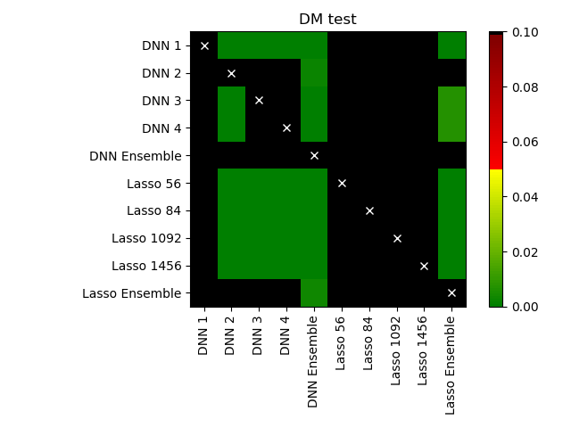

.. _dm:

=====================
Diebold-Mariano test
=====================
This module provides a function :py:class:`DM <epftoolbox.evaluation.DM
>` that implements the one-sided version of the Diebold-Mariano (DM) test in the context of electricity price forecasting. 

Besides the DM test, the module also provides a function :py:class:`plot_multivariate_DM_test <epftoolbox.evaluation.plot_multivariate_DM_test>` to plot the DM results when comparing multiple forecasts.

DM test
--------

The Diebold-Mariano (DM) test is probably the most commonly used tool to evaluate the significance of differences in forecasting accuracy. It is an asymptotic z-test of the hypothesis that the mean of the loss differential series: 

.. math::

	\begin{equation}
	\Delta^{\mathrm{A, B}}_{k} = L(\varepsilon^\mathrm{A}_{k}) - L(\varepsilon^\mathrm{B}_{k})
	\end{equation}

where :math:`\varepsilon^\mathrm{Z}_{k}=p_{k}-\hat{p}_{k}` is the prediction error of model Z for time step
:math:`k` and :math:`L(\cdot)` is the loss function. For point forecasts, we usually take :math:`L(\varepsilon^\mathrm{Z}_{k})=|\varepsilon^\mathrm{Z}_{k}|^p` with :math:`p=1` or :math:`2`, which corresponds to the absolute and squared losses.

This module implements the one-sided version of the DM test using the a function :py:class:`DM <epftoolbox.evaluation.DM
>` function. Given the forecast of a model A and the forecast of a model B, the test evaluates the null hypothesis :math:`H_0` of the mean of the loss differential of model A being lower or equal than that of model B. Hence, rejecting the null :math:`H_0` means that the forecasts of model B are significantly more accurate than those of model A. 

The module provides the two standard versions of the test in electricity price forecasting: an univariate and a multivariate version. The univariate version of the test has the advantage of providing a deeper analysis as 
it indicates which forecast is significantly better for which hour of the days. The multivariate version 
grants a better representation of the results as it summarizes the comparison in a single p-value.

.. autofunction:: epftoolbox.evaluation.DM

plot_multivariate_DM_test
------------------------------------------------------

The :py:class:`plot_multivariate_DM_test <epftoolbox.evaluation.plot_multivariate_DM_test>` provides an easy-to-use interface to plot in a heat map with a chessboard shape the results of using the DM test to compare the forecasts of multiple models. An example of the heat map is provided below in the function example.

.. autofunction:: epftoolbox.evaluation.plot_multivariate_DM_test

