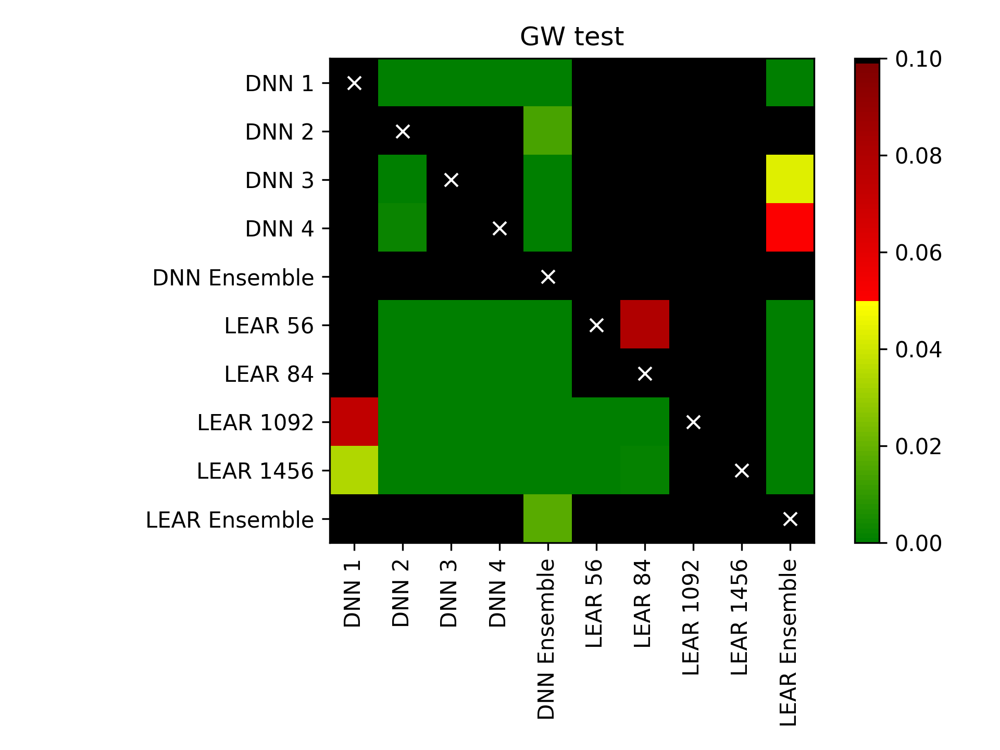

.. _gw:

=====================
Giacomini-White test
=====================
This module provides a function :py:class:`GW <epftoolbox.evaluation.GW>` that implements the one-sided version of the Giacomini-White (GW) test for Conditional Predictive Ability (CPA) in the context of electricity price forecasting. 

Additionally, the module provides a function :py:class:`plot_multivariate_GW_test <epftoolbox.evaluation.plot_multivariate_GW_test>` that plots the results of pairwise comparisonsi between multiple models.

GW test
--------

The Giacomini-White (GW) test can be seen as a generalization of the :ref:`Diebold-Mariano test` that measures the CPA instead of the Unconditional Predictive Ability. The test, like the :ref:`DM variant <Diebold-Mariano test>`, measures the statistical significance of the differences of two models forecasts. It is an asymptotic :math:`\chi^2`-test of the null hypothesis :math:`\mathrm{H}_0:\phi=0` in the regression: 

.. math::
   \begin{equation}
   \Delta^{\mathrm{A, B}}_d = \phi'\mathbb{X}_{d-1} + \varepsilon_d,
   \end{equation}

where :math:`\mathbb{X}_{d-1}` contains elements from the information set on day :math:`d-1`, i.e., a constant and lags of :math:`\Delta^{\mathrm{A, B}}_d`. The loss differential is obtained like in the DM test:

.. math::

	\begin{equation}
	\Delta^{\mathrm{A, B}}_{k} = L(\varepsilon^\mathrm{A}_{k}) - L(\varepsilon^\mathrm{B}_{k})
	\end{equation}

where :math:`\varepsilon^\mathrm{Z}_{k}=p_{k}-\hat{p}_{k}` is the prediction error of model Z for time step
:math:`k` and :math:`L(\cdot)` is the loss function. For point forecasts, we usually take :math:`L(\varepsilon^\mathrm{Z}_{k})=|\varepsilon^\mathrm{Z}_{k}|^p` with :math:`p=1` or :math:`2`, which corresponds to the absolute and squared losses.

This module implements the one-sided version of the GW test using the a function :py:class:`GW <epftoolbox.evaluation.GW>` function. Given the forecast of a model A and the forecast of a model B, the test evaluates the null hypothesis :math:`H_0` of the CPA of the loss differential of model A being higher or equal than that of model B. Hence, rejecting the null :math:`H_0` means that the forecasts of model B are significantly more accurate than those of model A. 

The module provides the two standard versions of the test in electricity price forecasting: an univariate and a multivariate version. The univariate version of the test has the advantage of providing a deeper analysis as it indicates which forecast is significantly better for which hour of the days. The multivariate version grants a better representation of the results as it summarizes the comparison in a single p-value.

.. autofunction:: epftoolbox.evaluation.GW

plot_multivariate_GW_test
------------------------------------------------------

The :py:class:`plot_multivariate_GW_test <epftoolbox.evaluation.plot_multivariate_GW_test>` provides an easy-to-use interface to plot in a heat map with a chessboard shape the results of using the DM test to compare the forecasts of multiple models. An example of the heat map is provided below in the function example.

.. autofunction:: epftoolbox.evaluation.plot_multivariate_GW_test

